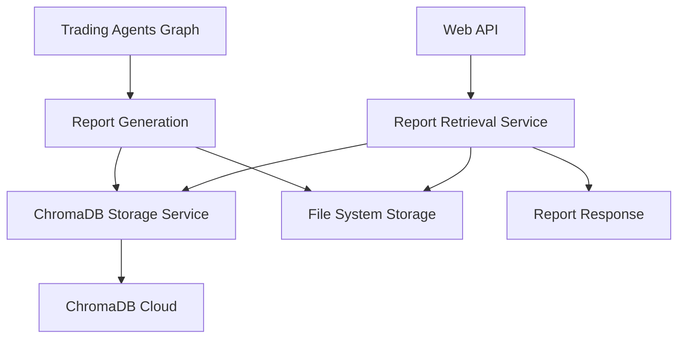
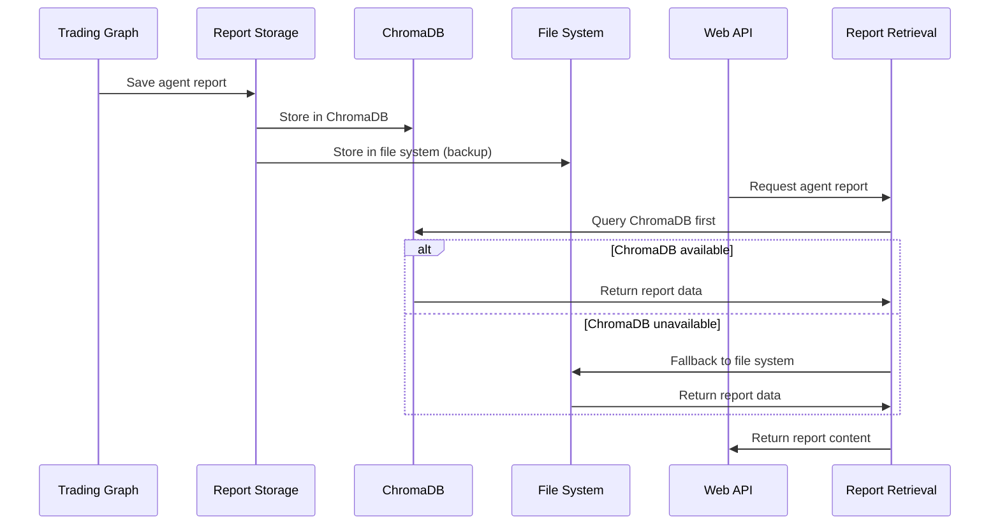

# Design Document

## Overview

The ChromaDB Report Storage system will integrate ChromaDB cloud database to persistently store and retrieve trading agent reports. This addresses the current issue where reports show "Unable to Load Report" errors by providing a reliable database-backed storage mechanism alongside the existing file-based system.

The system will maintain backward compatibility with the current file-based approach while adding ChromaDB as the primary storage mechanism for reliability and scalability.

## Architecture

### High-Level Architecture



### Component Interaction Flow



## Components and Interfaces

### 1. ChromaDB Configuration Module

**Location:** `tradingagents/storage/chromadb_config.py`

**Purpose:** Manage ChromaDB client initialization and configuration

**Interface:**
```python
class ChromaDBConfig:
    def __init__(self):
        self.api_key = os.getenv('CHROMADB_API_KEY')
        self.tenant = os.getenv('CHROMADB_TENANT')
        self.database = os.getenv('CHROMADB_DATABASE')
    
    def create_client(self) -> chromadb.CloudClient:
        """Create and return ChromaDB cloud client"""
    
    def validate_config(self) -> bool:
        """Validate required environment variables are set"""
```

### 2. Report Storage Service

**Location:** `tradingagents/storage/report_storage.py`

**Purpose:** Handle saving and retrieving reports from ChromaDB

**Interface:**
```python
class ReportStorageService:
    def __init__(self, chromadb_client):
        self.client = chromadb_client
        self.collection = self._get_or_create_collection()
    
    def save_agent_report(self, session_id: str, agent_name: str, 
                         report_content: str, metadata: dict):
        """Save individual agent report to ChromaDB"""
    
    def save_final_decision(self, session_id: str, decision: str, 
                           analysis: str, metadata: dict):
        """Save final decision and analysis"""
    
    def get_agent_report(self, session_id: str, agent_name: str) -> str:
        """Retrieve specific agent report"""
    
    def get_session_reports(self, session_id: str) -> dict:
        """Get all reports for a session"""
```

### 3. Report Retrieval Service

**Location:** `tradingagents/storage/report_retrieval.py`

**Purpose:** Unified interface for retrieving reports with fallback logic

**Interface:**
```python
class ReportRetrievalService:
    def __init__(self, storage_service, file_fallback=True):
        self.storage_service = storage_service
        self.file_fallback = file_fallback
    
    def get_report(self, ticker: str, date: str, agent: str) -> ReportResponse:
        """Get report with ChromaDB first, file system fallback"""
    
    def _generate_session_id(self, ticker: str, date: str) -> str:
        """Generate consistent session ID from ticker and date"""
    
    def _fallback_to_file(self, ticker: str, date: str, agent: str) -> str:
        """Fallback to existing file-based retrieval"""
```

### 4. Integration Points

**Trading Graph Integration:**
- Modify `TradingAgentsGraph._log_state()` to save reports to ChromaDB
- Add report storage calls after each agent completes

**Web API Integration:**
- Update `/api/reports/{ticker}/{date}/{agent}` endpoint
- Replace direct file reading with ReportRetrievalService

## Data Models

### ChromaDB Collection Schema

**Collection Name:** `trading_reports`

**Document Structure:**
```python
{
    "id": "session_id",  # Format: "{ticker}_{date}"
    "metadata": {
        "ticker": str,
        "analysis_date": str,
        "created_at": str,
        "updated_at": str
    },
    "document": json.dumps({
        "market_analyst": str,           # Market analysis report
        "social_analyst": str,           # Social media sentiment report  
        "news_analyst": str,             # News analysis report
        "fundamentals_analyst": str,     # Fundamentals analysis report
        "bull_researcher": str,          # Bull research report
        "bear_researcher": str,          # Bear research report
        "research_manager": str,         # Research manager summary
        "trader": str,                   # Trader investment plan
        "risky_analyst": str,           # Risk management - risky perspective
        "neutral_analyst": str,         # Risk management - neutral perspective
        "safe_analyst": str,            # Risk management - safe perspective
        "portfolio_manager": str,       # Portfolio manager final decision
        "final_decision": str,          # Final trading decision
        "final_analysis": str           # Final analysis summary
    })
}
```

### Session ID Generation

**Format:** `{ticker}_{date}`
**Example:** `PYPL_2025-09-12`

This ensures unique identification while maintaining readability and consistency with existing file structure.

## Error Handling

### ChromaDB Connection Failures
- Log connection errors with appropriate severity
- Gracefully fallback to file-based storage/retrieval
- Provide clear error messages to users
- Implement retry logic with exponential backoff

### Data Consistency
- Ensure both ChromaDB and file system are updated atomically where possible
- Handle partial failures gracefully
- Implement data validation before storage

### Missing Reports
- Return structured error responses indicating specific missing reports
- Distinguish between ChromaDB unavailable vs report not found
- Provide helpful error messages for debugging

## Testing Strategy

### Unit Tests
- ChromaDB client initialization and configuration
- Report storage and retrieval operations
- Error handling scenarios
- Session ID generation logic

### Integration Tests
- End-to-end report storage during analysis
- Web API report retrieval with ChromaDB
- Fallback behavior when ChromaDB is unavailable
- Data consistency between ChromaDB and file system

### Performance Tests
- Report storage performance under load
- Query performance for report retrieval
- Memory usage with large report content

### Error Scenario Tests
- ChromaDB service unavailable
- Invalid API credentials
- Network connectivity issues
- Malformed report data

## Security Considerations

### API Key Management
- Store ChromaDB API key securely in environment variables
- Never log or expose API keys in error messages
- Validate API key format before use

### Data Validation
- Sanitize report content before storage
- Validate session IDs and agent names
- Implement input size limits to prevent abuse

### Access Control
- Use ChromaDB tenant isolation for security
- Implement proper error handling to avoid information leakage
- Log access attempts for audit purposes

## Performance Considerations

### Storage Optimization
- Use efficient JSON serialization for report content
- Implement compression for large reports if needed
- Batch operations where possible

### Retrieval Optimization
- Cache frequently accessed reports
- Use appropriate ChromaDB query patterns
- Implement connection pooling if needed

### Scalability
- Design for horizontal scaling with multiple analysis sessions
- Consider partitioning strategies for large datasets
- Monitor storage usage and implement cleanup policies

## Migration Strategy

### Phase 1: Add ChromaDB Storage
- Implement ChromaDB configuration and storage services
- Add parallel storage to both ChromaDB and file system
- No changes to retrieval logic initially

### Phase 2: Update Retrieval
- Modify web API to use ChromaDB first
- Implement fallback to file system
- Test thoroughly with existing data

### Phase 3: Full Integration
- Update all report generation points to use ChromaDB
- Add monitoring and alerting
- Optimize performance based on usage patterns

### Rollback Plan
- Maintain file-based storage as backup
- Ability to disable ChromaDB via configuration
- Clear rollback procedures documented