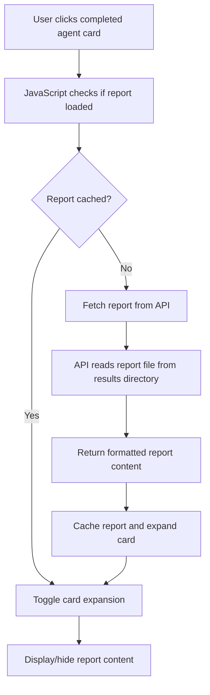

# Design Document

## Overview

This design document outlines the enhancement of the TradingAgents webapp to transform the current simple progress indicators into interactive collapsible cards that display detailed agent reports. The solution will provide users with immediate access to the analysis content generated by each agent while maintaining a clean, organized interface.

## Architecture

### Component Structure

The enhancement will modify the existing webapp architecture by:

1. **Frontend Components**: Updating the HTML structure, CSS styling, and JavaScript functionality to support collapsible cards
2. **Backend Integration**: Adding new API endpoints to serve report content from the file system
3. **Data Flow**: Implementing a report loading mechanism that fetches content when cards are expanded

### Data Flow



## Components and Interfaces

### 1. Card Component Structure

Each agent will be represented by a card component with the following structure:

```html
<div class="agent-card" data-agent="agent-name" data-status="pending|in_progress|completed|error">
  <div class="card-header">
    <div class="agent-info">
      <span class="agent-name">Agent Name</span>
      <span class="status-badge">Status</span>
    </div>
    <div class="card-controls">
      <i class="expand-icon fas fa-chevron-down"></i>
    </div>
  </div>
  <div class="card-body collapse">
    <div class="report-content">
      <!-- Report content loaded dynamically -->
    </div>
  </div>
</div>
```

### 2. Team Section Organization

Cards will be organized within team sections:

```html
<div class="team-section">
  <div class="team-header">
    <h4>Team Name</h4>
  </div>
  <div class="team-cards">
    <!-- Agent cards for this team -->
  </div>
</div>
```

### 3. API Endpoints

#### GET /api/reports/{ticker}/{date}/{agent}

**Purpose**: Retrieve the report content for a specific agent

**Parameters**:
- `ticker`: Stock ticker symbol (e.g., "PYPL")
- `date`: Analysis date (e.g., "2025-09-12")  
- `agent`: Agent identifier (e.g., "market", "news", "fundamentals")

**Response**:
```json
{
  "success": true,
  "agent": "market",
  "report_content": "# Market Analysis Report\n\n...",
  "report_type": "markdown"
}
```

**Error Response**:
```json
{
  "success": false,
  "error": "Report not found",
  "message": "No report file found for market analyst"
}
```

### 4. Report File Mapping

The system will map agent names to their corresponding report files:

```javascript
const AGENT_REPORT_MAPPING = {
  'Market Analyst': 'market_report.md',
  'Social Analyst': 'sentiment_report.md', 
  'News Analyst': 'news_report.md',
  'Fundamentals Analyst': 'fundamentals_report.md',
  'Bull Researcher': 'investment_plan.md',
  'Bear Researcher': 'investment_plan.md',
  'Research Manager': 'investment_plan.md',
  'Trader': 'trader_investment_plan.md',
  'Risky Analyst': 'final_trade_decision.md',
  'Neutral Analyst': 'final_trade_decision.md', 
  'Safe Analyst': 'final_trade_decision.md',
  'Portfolio Manager': 'final_trade_decision.md'
};
```

## Data Models

### Agent Card State

```javascript
class AgentCard {
  constructor(agentName, teamName) {
    this.agentName = agentName;
    this.teamName = teamName;
    this.status = 'pending'; // pending, in_progress, completed, error
    this.isExpanded = false;
    this.reportContent = null;
    this.reportLoaded = false;
  }
  
  updateStatus(newStatus) {
    this.status = newStatus;
    this.updateUI();
  }
  
  async loadReport(ticker, date) {
    if (this.reportLoaded) return;
    
    try {
      const response = await fetch(`/api/reports/${ticker}/${date}/${this.getAgentKey()}`);
      const data = await response.json();
      
      if (data.success) {
        this.reportContent = data.report_content;
        this.reportLoaded = true;
      } else {
        this.reportContent = `<p class="text-muted">No detailed report available for ${this.agentName}</p>`;
      }
    } catch (error) {
      this.reportContent = `<p class="text-danger">Error loading report: ${error.message}</p>`;
    }
  }
  
  toggleExpansion() {
    this.isExpanded = !this.isExpanded;
    this.updateUI();
  }
}
```

### Report Content Formatter

```javascript
class ReportFormatter {
  static formatMarkdown(content) {
    return content
      .replace(/### (.*)/g, '<h5 class="report-heading">$1</h5>')
      .replace(/## (.*)/g, '<h4 class="report-heading">$1</h4>')
      .replace(/# (.*)/g, '<h3 class="report-heading">$1</h3>')
      .replace(/\*\*(.*?)\*\*/g, '<strong>$1</strong>')
      .replace(/\*(.*?)\*/g, '<em>$1</em>')
      .replace(/\n\n/g, '</p><p>')
      .replace(/\n/g, '<br>')
      .replace(/^/, '<p>')
      .replace(/$/, '</p>')
      .replace(/\|(.+)\|/g, (match, content) => {
        // Handle table formatting
        const cells = content.split('|').map(cell => cell.trim());
        return `<tr>${cells.map(cell => `<td>${cell}</td>`).join('')}</tr>`;
      });
  }
  
  static wrapInTable(content) {
    if (content.includes('<tr>')) {
      return `<table class="table table-sm table-striped">${content}</table>`;
    }
    return content;
  }
}
```

## Error Handling

### Report Loading Errors

1. **File Not Found**: Display a user-friendly message indicating no detailed report is available
2. **Network Errors**: Show retry option and cache the error state to avoid repeated failed requests
3. **Parsing Errors**: Fall back to displaying raw content with basic formatting

### UI Error States

```javascript
const ERROR_MESSAGES = {
  REPORT_NOT_FOUND: "No detailed report available for this agent",
  NETWORK_ERROR: "Unable to load report. Please try again.",
  PARSING_ERROR: "Report content could not be formatted properly"
};
```

## Testing Strategy

### Unit Tests

1. **AgentCard Class**: Test status updates, report loading, and expansion toggling
2. **ReportFormatter**: Test markdown to HTML conversion with various content types
3. **API Integration**: Test report fetching with different scenarios (success, not found, error)

### Integration Tests

1. **Card Interaction Flow**: Test complete user interaction from clicking card to viewing report
2. **Team Section Organization**: Verify proper grouping and display of agent cards
3. **Real Data Integration**: Test with actual report files from the results directory

### User Experience Tests

1. **Performance**: Ensure smooth animations and responsive card interactions
2. **Accessibility**: Verify keyboard navigation and screen reader compatibility
3. **Mobile Responsiveness**: Test card layout and expansion on different screen sizes

## Implementation Phases

### Phase 1: Backend API Development
- Create report serving endpoint
- Implement file reading and error handling
- Add agent-to-file mapping logic

### Phase 2: Frontend Card Structure
- Update HTML structure for collapsible cards
- Implement CSS styling for different states
- Add team section organization

### Phase 3: Interactive Functionality
- Implement card expansion/collapse logic
- Add report loading and caching
- Integrate with existing WebSocket status updates

### Phase 4: Content Formatting
- Implement markdown to HTML conversion
- Add table and list formatting support
- Enhance visual presentation of reports

### Phase 5: Testing and Polish
- Add error handling and fallback states
- Implement loading animations
- Optimize performance and user experience