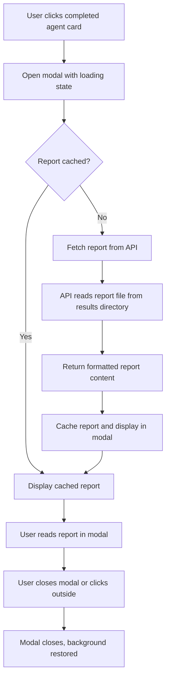

# Design Document

## Overview

This design document outlines the replacement of the collapsible card system with a modal popup approach for displaying agent reports in the TradingAgents webapp. The solution simplifies the UI by using clean, simple cards that open detailed reports in focused modal dialogs, eliminating complex expansion logic and providing better user experience.

## Architecture

### Component Structure

The modal implementation will consist of:

1. **Simple Agent Cards**: Clean card components with status indicators only
2. **Modal Component**: Reusable modal dialog for displaying report content
3. **Report API**: Backend endpoint for serving report content
4. **Cache Manager**: Client-side caching for efficient report loading

### Data Flow



## Components and Interfaces

### 1. Simplified Agent Card Structure

```html
<div class="agent-card" data-agent="agent-name" data-status="pending|in_progress|completed|error">
  <div class="card-content">
    <div class="agent-info">
      <span class="agent-name">Agent Name</span>
      <div class="status-indicator">
        <span class="status-badge status-{status}">Status</span>
        <div class="loading-spinner" style="display: none;"></div>
      </div>
    </div>
  </div>
</div>
```

### 2. Modal Component Structure

```html
<div id="reportModal" class="modal-overlay" style="display: none;">
  <div class="modal-container">
    <div class="modal-header">
      <h3 class="modal-title">Agent Report</h3>
      <button class="modal-close" aria-label="Close modal">
        <i class="fas fa-times"></i>
      </button>
    </div>
    <div class="modal-body">
      <div class="loading-state" style="display: none;">
        <div class="spinner"></div>
        <p>Loading report...</p>
      </div>
      <div class="error-state" style="display: none;">
        <p class="error-message"></p>
        <button class="retry-button">Retry</button>
      </div>
      <div class="report-content" style="display: none;">
        <!-- Report content loaded dynamically -->
      </div>
    </div>
  </div>
</div>
```

### 3. API Endpoint (Reuse Existing)

The existing API endpoint will be reused:

#### GET /api/reports/{ticker}/{date}/{agent}

**Response remains the same**:
```json
{
  "success": true,
  "agent": "market",
  "report_content": "# Market Analysis Report\n\n...",
  "report_type": "markdown"
}
```

### 4. Report Cache Manager

```javascript
class ReportCache {
  constructor() {
    this.cache = new Map();
    this.currentTicker = null;
    this.currentDate = null;
  }
  
  setContext(ticker, date) {
    if (this.currentTicker !== ticker || this.currentDate !== date) {
      this.cache.clear();
      this.currentTicker = ticker;
      this.currentDate = date;
    }
  }
  
  get(agentKey) {
    return this.cache.get(agentKey);
  }
  
  set(agentKey, content) {
    this.cache.set(agentKey, content);
  }
  
  has(agentKey) {
    return this.cache.has(agentKey);
  }
  
  clear() {
    this.cache.clear();
  }
}
```

## Data Models

### Modal Manager

```javascript
class ModalManager {
  constructor() {
    this.modal = document.getElementById('reportModal');
    this.modalTitle = this.modal.querySelector('.modal-title');
    this.loadingState = this.modal.querySelector('.loading-state');
    this.errorState = this.modal.querySelector('.error-state');
    this.reportContent = this.modal.querySelector('.report-content');
    this.closeButton = this.modal.querySelector('.modal-close');
    this.retryButton = this.modal.querySelector('.retry-button');
    
    this.setupEventListeners();
  }
  
  setupEventListeners() {
    // Close modal on background click
    this.modal.addEventListener('click', (e) => {
      if (e.target === this.modal) {
        this.close();
      }
    });
    
    // Close modal on close button click
    this.closeButton.addEventListener('click', () => {
      this.close();
    });
    
    // Close modal on ESC key
    document.addEventListener('keydown', (e) => {
      if (e.key === 'Escape' && this.isOpen()) {
        this.close();
      }
    });
    
    // Retry button
    this.retryButton.addEventListener('click', () => {
      this.currentRetryCallback && this.currentRetryCallback();
    });
  }
  
  open(agentName) {
    this.modalTitle.textContent = `${agentName} Report`;
    this.modal.style.display = 'flex';
    document.body.style.overflow = 'hidden';
    this.showLoading();
  }
  
  close() {
    this.modal.style.display = 'none';
    document.body.style.overflow = '';
    this.currentRetryCallback = null;
  }
  
  isOpen() {
    return this.modal.style.display === 'flex';
  }
  
  showLoading() {
    this.loadingState.style.display = 'block';
    this.errorState.style.display = 'none';
    this.reportContent.style.display = 'none';
  }
  
  showError(message, retryCallback) {
    this.loadingState.style.display = 'none';
    this.errorState.style.display = 'block';
    this.reportContent.style.display = 'none';
    this.errorState.querySelector('.error-message').textContent = message;
    this.currentRetryCallback = retryCallback;
  }
  
  showContent(content) {
    this.loadingState.style.display = 'none';
    this.errorState.style.display = 'none';
    this.reportContent.style.display = 'block';
    this.reportContent.innerHTML = content;
  }
}
```

### Agent Card Manager

```javascript
class AgentCardManager {
  constructor(modalManager, reportCache) {
    this.modalManager = modalManager;
    this.reportCache = reportCache;
    this.setupCardListeners();
  }
  
  setupCardListeners() {
    document.addEventListener('click', (e) => {
      const card = e.target.closest('.agent-card[data-status="completed"]');
      if (card) {
        this.handleCardClick(card);
      }
    });
  }
  
  async handleCardClick(card) {
    const agentName = card.querySelector('.agent-name').textContent;
    const agentKey = this.getAgentKey(agentName);
    
    this.modalManager.open(agentName);
    
    try {
      let content;
      
      if (this.reportCache.has(agentKey)) {
        content = this.reportCache.get(agentKey);
        this.modalManager.showContent(content);
      } else {
        content = await this.loadReport(agentKey);
        this.reportCache.set(agentKey, content);
        this.modalManager.showContent(content);
      }
    } catch (error) {
      this.modalManager.showError(
        'Failed to load report. Please try again.',
        () => this.handleCardClick(card)
      );
    }
  }
  
  async loadReport(agentKey) {
    const ticker = getCurrentTicker();
    const date = getCurrentDate();
    
    const response = await fetch(`/api/reports/${ticker}/${date}/${agentKey}`);
    const data = await response.json();
    
    if (data.success) {
      return ReportFormatter.formatMarkdown(data.report_content);
    } else {
      return `<p class="text-muted">No detailed report available for this agent.</p>`;
    }
  }
  
  getAgentKey(agentName) {
    const mapping = {
      'Market Analyst': 'market',
      'Social Analyst': 'sentiment',
      'News Analyst': 'news',
      'Fundamentals Analyst': 'fundamentals',
      'Bull Researcher': 'investment',
      'Bear Researcher': 'investment',
      'Research Manager': 'investment',
      'Trader': 'trader',
      'Risky Analyst': 'final',
      'Neutral Analyst': 'final',
      'Safe Analyst': 'final',
      'Portfolio Manager': 'final'
    };
    return mapping[agentName] || agentName.toLowerCase().replace(' ', '_');
  }
}
```

### Report Formatter (Simplified)

```javascript
class ReportFormatter {
  static formatMarkdown(content) {
    return content
      .replace(/### (.*)/g, '<h5 class="report-heading">$1</h5>')
      .replace(/## (.*)/g, '<h4 class="report-heading">$1</h4>')
      .replace(/# (.*)/g, '<h3 class="report-heading">$1</h3>')
      .replace(/\*\*(.*?)\*\*/g, '<strong>$1</strong>')
      .replace(/\*(.*?)\*/g, '<em>$1</em>')
      .replace(/\n\n/g, '</p><p>')
      .replace(/\n/g, '<br>')
      .replace(/^(.)/gm, '<p>$1')
      .replace(/(.)\n/g, '$1</p>')
      .replace(/<p><\/p>/g, '');
  }
}
```

## CSS Styling

### Modal Styles

```css
.modal-overlay {
  position: fixed;
  top: 0;
  left: 0;
  width: 100%;
  height: 100%;
  background-color: rgba(0, 0, 0, 0.5);
  display: flex;
  justify-content: center;
  align-items: center;
  z-index: 1000;
}

.modal-container {
  background: white;
  border-radius: 8px;
  width: 90%;
  max-width: 800px;
  max-height: 90vh;
  display: flex;
  flex-direction: column;
  box-shadow: 0 4px 20px rgba(0, 0, 0, 0.15);
}

.modal-header {
  padding: 20px;
  border-bottom: 1px solid #e9ecef;
  display: flex;
  justify-content: space-between;
  align-items: center;
}

.modal-body {
  padding: 20px;
  overflow-y: auto;
  flex: 1;
}

.modal-close {
  background: none;
  border: none;
  font-size: 24px;
  cursor: pointer;
  color: #6c757d;
}

.modal-close:hover {
  color: #495057;
}
```

### Simplified Card Styles

```css
.agent-card {
  background: white;
  border: 1px solid #e9ecef;
  border-radius: 8px;
  padding: 16px;
  margin-bottom: 12px;
  transition: all 0.2s ease;
}

.agent-card[data-status="completed"] {
  cursor: pointer;
}

.agent-card[data-status="completed"]:hover {
  border-color: #007bff;
  box-shadow: 0 2px 8px rgba(0, 123, 255, 0.15);
}

.status-badge {
  padding: 4px 8px;
  border-radius: 4px;
  font-size: 12px;
  font-weight: 600;
  text-transform: uppercase;
}

.status-pending { background-color: #6c757d; color: white; }
.status-in_progress { background-color: #007bff; color: white; }
.status-completed { background-color: #28a745; color: white; }
.status-error { background-color: #dc3545; color: white; }
```

## Error Handling

### Modal Error States

1. **Network Errors**: Show retry button with clear error message
2. **Report Not Found**: Display user-friendly "no report available" message
3. **Loading Timeout**: Implement timeout with retry option
4. **Invalid Response**: Handle malformed API responses gracefully

### Cache Management

1. **Memory Limits**: Clear cache when switching contexts (ticker/date)
2. **Stale Data**: Cache is session-based, cleared on page refresh
3. **Error Caching**: Don't cache failed requests to allow retries

## Testing Strategy

### Unit Tests

1. **ModalManager**: Test open/close functionality, state management
2. **ReportCache**: Test caching logic, context switching
3. **ReportFormatter**: Test markdown to HTML conversion
4. **AgentCardManager**: Test card click handling and report loading

### Integration Tests

1. **Modal Workflow**: Test complete user flow from card click to report display
2. **API Integration**: Test report fetching with various response scenarios
3. **Cache Behavior**: Test caching across multiple modal opens

### Cleanup Verification

1. **Dead Code Removal**: Verify all collapsible card code is removed
2. **CSS Cleanup**: Ensure no unused expansion/collapse styles remain
3. **Test Cleanup**: Verify all expansion-related tests are removed

## Implementation Phases

### Phase 1: Modal Infrastructure
- Create modal HTML structure and CSS
- Implement ModalManager class
- Add basic open/close functionality

### Phase 2: Report Loading
- Implement ReportCache and AgentCardManager
- Add API integration for report fetching
- Implement error handling and retry logic

### Phase 3: Card Simplification
- Remove all collapsible card logic
- Simplify card HTML structure
- Update card styling for click interaction

### Phase 4: Cleanup and Testing
- Remove all expansion-related code and tests
- Clean up unused CSS classes
- Add comprehensive tests for modal functionality

### Phase 5: Polish and Optimization
- Add loading animations and transitions
- Optimize caching strategy
- Ensure accessibility compliance