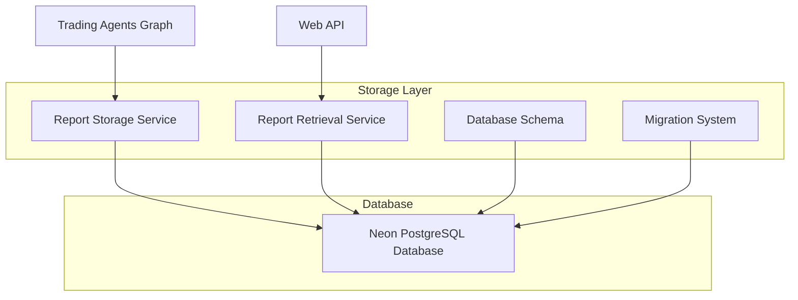

# Design Document

## Overview

This design replaces the existing ChromaDB implementation with Neon PostgreSQL for storing and retrieving trading agent reports. The system will use Drizzle ORM for type-safe database operations and provide a robust storage layer that can handle concurrent writes and efficient reads for the web application.

The architecture follows a clean separation of concerns with dedicated modules for database configuration, schema definition, storage operations, and API integration.

## Architecture

### High-Level Architecture



### Database Schema Design

The system will use a single table to store all agent reports for each analysis session:

```sql
CREATE TABLE agent_reports (
    id UUID PRIMARY KEY DEFAULT gen_random_uuid(),
    session_id VARCHAR(255) UNIQUE NOT NULL,
    ticker VARCHAR(10) NOT NULL,
    analysis_date DATE NOT NULL,
    created_at TIMESTAMP DEFAULT CURRENT_TIMESTAMP,
    updated_at TIMESTAMP DEFAULT CURRENT_TIMESTAMP,
    
    -- Individual Agent Reports
    market_analyst_report TEXT,
    news_analyst_report TEXT,
    fundamentals_analyst_report TEXT,
    social_analyst_report TEXT,
    bull_researcher_report TEXT,
    bear_researcher_report TEXT,
    research_manager_report TEXT,
    trader_report TEXT,
    
    -- Risk Management Reports
    risky_analyst_report TEXT,
    neutral_analyst_report TEXT,
    safe_analyst_report TEXT,
    
    -- Final Results
    portfolio_manager_report TEXT,
    final_decision TEXT,
    final_analysis TEXT,
    recommendation VARCHAR(10) -- BUY, SELL, HOLD
);

CREATE INDEX idx_session_id ON agent_reports(session_id);
CREATE INDEX idx_ticker_date ON agent_reports(ticker, analysis_date);
```

## Components and Interfaces

### 1. Database Configuration Module

**File**: `tradingagents/storage/neon_config.py`

```python
class NeonConfig:
    def __init__(self):
        self.connection_string = os.getenv('NEON_DATABASE_URL')
        self.pool_size = int(os.getenv('DB_POOL_SIZE', '10'))
        
    def get_connection(self) -> Connection
    def validate_connection(self) -> bool
    def create_pool(self) -> ConnectionPool
```

### 2. Database Schema Module

**File**: `tradingagents/storage/schema.py`

Using Drizzle ORM for type-safe schema definition:

```python
from drizzle_orm import Table, Column, String, Text, DateTime, UUID

agent_reports_table = Table(
    'agent_reports',
    Column('id', UUID, primary_key=True),
    Column('session_id', String(255), unique=True, not_null=True),
    Column('ticker', String(10), not_null=True),
    # ... other columns
)
```

### 3. Report Storage Service

**File**: `tradingagents/storage/report_storage.py`

```python
class ReportStorageService:
    def __init__(self, config: NeonConfig)
    
    async def create_session(self, ticker: str, analysis_date: str) -> str
    async def save_agent_report(self, session_id: str, agent_type: str, report_content: str) -> bool
    async def save_final_decision(self, session_id: str, decision: str, analysis: str, recommendation: str) -> bool
    async def update_session_timestamp(self, session_id: str) -> bool
```

### 4. Report Retrieval Service

**File**: `tradingagents/storage/report_retrieval.py`

```python
class ReportRetrievalService:
    def __init__(self, config: NeonConfig)
    
    async def get_agent_report(self, session_id: str, agent_type: str) -> Optional[str]
    async def get_session_reports(self, session_id: str) -> Dict[str, Any]
    async def get_final_decision(self, session_id: str) -> Optional[Dict[str, str]]
    async def session_exists(self, session_id: str) -> bool
```

### 5. Session ID Generation

**File**: `tradingagents/storage/session_utils.py`

```python
def generate_session_id(ticker: str, analysis_date: str) -> str:
    """Generate unique session ID: {ticker}_{date}_{timestamp}"""
    timestamp = int(time.time())
    return f"{ticker}_{analysis_date}_{timestamp}"

def parse_session_id(session_id: str) -> Tuple[str, str, int]:
    """Parse session ID back to components"""
```

## Data Models

### Agent Report Record

```python
@dataclass
class AgentReportRecord:
    id: str
    session_id: str
    ticker: str
    analysis_date: date
    created_at: datetime
    updated_at: datetime
    
    # Agent reports
    market_analyst_report: Optional[str] = None
    news_analyst_report: Optional[str] = None
    fundamentals_analyst_report: Optional[str] = None
    social_analyst_report: Optional[str] = None
    bull_researcher_report: Optional[str] = None
    bear_researcher_report: Optional[str] = None
    research_manager_report: Optional[str] = None
    trader_report: Optional[str] = None
    risky_analyst_report: Optional[str] = None
    neutral_analyst_report: Optional[str] = None
    safe_analyst_report: Optional[str] = None
    portfolio_manager_report: Optional[str] = None
    
    # Final results
    final_decision: Optional[str] = None
    final_analysis: Optional[str] = None
    recommendation: Optional[str] = None
```

### Agent Type Mapping

```python
AGENT_TYPE_MAPPING = {
    'Market Analyst': 'market_analyst_report',
    'News Analyst': 'news_analyst_report',
    'Fundamentals Analyst': 'fundamentals_analyst_report',
    'Social Analyst': 'social_analyst_report',
    'Bull Researcher': 'bull_researcher_report',
    'Bear Researcher': 'bear_researcher_report',
    'Research Manager': 'research_manager_report',
    'Trader': 'trader_report',
    'Risky Analyst': 'risky_analyst_report',
    'Neutral Analyst': 'neutral_analyst_report',
    'Safe Analyst': 'safe_analyst_report',
    'Portfolio Manager': 'portfolio_manager_report'
}
```

## Error Handling

### Database Connection Errors

- Implement connection pooling with automatic retry
- Graceful degradation when database is unavailable
- Comprehensive logging for debugging

### Data Validation

- Validate session IDs before database operations
- Sanitize report content before storage
- Handle large report content (>1MB) appropriately

### Concurrent Access

- Use database transactions for consistency
- Handle concurrent writes to the same session
- Implement optimistic locking for updates

## Testing Strategy

### Unit Tests

1. **Database Configuration Tests**
   - Connection string validation
   - Pool creation and management
   - Error handling for invalid configurations

2. **Storage Service Tests**
   - Session creation and uniqueness
   - Report saving for all agent types
   - Final decision storage
   - Error handling for database failures

3. **Retrieval Service Tests**
   - Individual report retrieval
   - Complete session data retrieval
   - Handling of missing reports
   - Performance with large datasets

### Integration Tests

1. **End-to-End Workflow Tests**
   - Complete analysis session from creation to retrieval
   - Multiple concurrent sessions
   - Database migration and schema updates

2. **API Integration Tests**
   - Web API endpoints with new storage backend
   - Error response consistency
   - Performance under load

### Performance Tests

1. **Database Performance**
   - Large report content storage and retrieval
   - Concurrent read/write operations
   - Query optimization validation

## Migration Strategy

### Phase 1: Setup and Infrastructure
- Install Neon and Drizzle dependencies
- Configure database connection
- Create and deploy schema

### Phase 2: Parallel Implementation
- Implement storage services alongside existing file system
- Add database operations without removing file operations
- Test with dual storage during development

### Phase 3: Integration and Cutover
- Update trading graph to use database storage
- Update web API to use database retrieval
- Remove ChromaDB dependencies and code

### Phase 4: Cleanup and Optimization
- Remove file-based storage code
- Optimize database queries and indexes
- Add monitoring and alerting

## Security Considerations

### Database Security
- Use SSL/TLS for all database connections
- Implement proper connection string handling
- Use environment variables for sensitive configuration

### Data Protection
- Sanitize report content to prevent injection attacks
- Implement proper access controls
- Log security-relevant events

### Connection Management
- Use connection pooling to prevent resource exhaustion
- Implement proper timeout handling
- Monitor connection health and performance